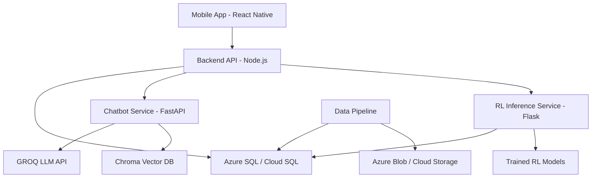

# WealthArena

WealthArena is a multi-agent investing insights platform combining reinforcement learning, real-time market analytics, and gamified education.

## 📽️ Demo

Click to watch the full demo video of **WealthArena – Learn Trading the Fun Way**:

[[Watch the Demo](https://youtube.com/shorts/eOe_1JZbYZI)

> This walkthrough showcases the WealthArena mobile app—featuring user onboarding, authentication, and interactive modules designed to gamify financial trading education.

## Key Features

- **AI-powered trading signals** (70%+ win rate target)
- **Educational chatbot** with RAG capabilities
- **Historical fast-forward investing game**
- **Real-time leaderboard**
- **Comprehensive portfolio management**

## Technology Stack

- **Frontend**: React Native (Expo)
- **Backend**: Node.js (Express)
- **Chatbot**: Python (FastAPI)
- **RL Service**: Python (Flask)
- **Database**: Azure SQL / Cloud SQL PostgreSQL
- **Deployment**: Azure Web Apps / GCP App Engine

## Architecture



## Repository Structure

- `frontend/`: Expo mobile app (React Native)
- `backend/`: Express API server (14 route modules)
- `chatbot/`: FastAPI chatbot with RAG (11 routers)
- `rl-service/`: Flask RL inference API (6 endpoints)
- `rl-training/`: RL model training code (Ray RLlib)
- `data-pipeline/`: Market data ingestion (443 symbols, 5 asset classes)
- `database/`: SQL schemas for Azure and GCP
- `infrastructure/`: Deployment scripts for Azure and GCP
- `docs/`: Comprehensive documentation

## Quick Start

### Prerequisites
- Node.js 18+
- Python 3.8+ (required for data-pipeline scripts)
- Azure CLI or gcloud CLI
- **GroQ API Key** (get from https://console.groq.com) - Required for chatbot

### Setup Options

#### Option 1: Simplified Setup (Recommended for Local Development)

**Best for**: Quick local development with mock database

```powershell
.\master_setup_simplified.ps1
```

This script:
- Configures environment variables
- Sets up network configuration
- Prepares all services
- Handles data pipeline setup (Phase 3.5)
- Auto-detects local IP for mobile device testing

**Data Pipeline Setup (Phase 3.5):**
- Automatically checks if market data exists
- If insufficient data is found (<10 CSV files), you'll be prompted to download data
- **MVP Mode (Recommended)**: Downloads ~50 stocks, faster setup (5-10 minutes)
- **Full Mode**: Downloads all stocks, complete dataset (30-60 minutes)
- Backend will auto-load CSV data on startup (~30 seconds)

#### Option 2: Full Local Setup (Complete Database Setup)

**Best for**: Full local development with PostgreSQL database

```powershell
.\master_setup_local.ps1
```

This script provides comprehensive setup including:
- Full dependency installation
- Database schema creation
- Data pipeline execution
- Windows Task Scheduler setup for daily data refresh
- APK build configuration

**Script Parameters:**
- `-SkipDependencies`: Skip npm/pip installations
- `-SkipDataDownload`: Skip market data download
- `-SkipDataProcessing`: Skip data processing step
- `-SkipAPKBuild`: Skip Android APK build
- `-DatabaseType`: `azuresql`, `postgresql`, or `skip` (default: `azuresql`)
- `-LocalIPOverride`: Manually specify local IP address

### First Time Setup Checklist

1. **Run Setup Script**
   ```powershell
   .\master_setup_simplified.ps1
   ```
   
2. **Verify Backend is Running**
   - Check that backend is running on port 3000
   - Verify database connection using `/api/health` endpoint
   - Test database connectivity: `http://localhost:3000/health`

3. **Check Database Connection**
   - Ensure database credentials are correct in `backend/.env.local`
   - Verify database is accessible from backend service
   - Check that database schema is created (see `database/` folder)

4. **Load CSV Data into Database**
   - **Mock Database Mode (USE_MOCK_DB=true)**: Data loads automatically on backend startup
     - Checks if local storage is empty (<10 records) or data is stale (>24h old)
     - Runs in background after server starts (non-blocking)
     - Logs: `✓ Market data loaded: X symbols, Y records` on success
     - Data is stored in `backend/data/local-market-data.json`
   - **Real Database Mode**: Data must be loaded manually via API endpoints
     - Call `POST /api/market-data/initialize` endpoint (requires authentication)
     - Or use `POST /api/market-data/update-database` endpoint
   - Verify data loaded: `GET /api/market-data/data-status` endpoint

5. **Verify Data Loaded Successfully**
   - Check data status: `GET /api/market-data/data-status`
   - Should show symbol count > 0 and available asset types
   - Test with: `GET /api/market-data/available-symbols`

### Data Pipeline Setup

Market data is required for the WealthArena application to function properly. The setup script (`master_setup_simplified.ps1`) handles data pipeline setup automatically in Phase 3.5.

#### Automatic Data Pipeline Setup

When running `master_setup_simplified.ps1`, the script will:

1. **Check Python Installation**: Verifies Python 3.8+ is installed and accessible
2. **Install Dependencies**: Installs Python packages from `data-pipeline/requirements.txt`
3. **Check Existing Data**: Scans for CSV files in data folders
4. **Prompt for Download** (if needed): If insufficient data is found (<10 files), offers two options:
   - **MVP Mode (Recommended)**: Downloads ~50 stocks, faster setup (5-10 minutes)
     - Limited dataset for faster development and testing
     - Suitable for most use cases
   - **Full Mode**: Downloads all stocks, complete dataset (30-60 minutes)
     - Complete historical data for all symbols
     - Recommended for production or comprehensive testing

#### Manual Data Pipeline Execution

For advanced users who want to manually run data-pipeline scripts:

```powershell
cd data-pipeline
pip install -r requirements.txt
python run_all_downloaders.py --mvp-mode --asx-limit 50
```

**Data Download Options:**
- MVP mode: `python run_all_downloaders.py --mvp-mode --asx-limit 50`
- Full mode: `python run_all_downloaders.py`

The backend will automatically load CSV files from data folders on startup (~30 seconds). Processed data is stored in `backend/data/local-market-data.json`.

#### Data Storage Locations

Market data CSV files are stored in the following folders:

- `stockDataRaw&Processed/` - Stock market data
- `cryptoData/` - Cryptocurrency data
- `forexData/` - Forex (currency) data
- `commoditiesData/` - Commodity data

**Legacy locations** (also supported):
- `data-pipeline/data/raw/stocks/`
- `data-pipeline/data/raw/crypto/`
- `data-pipeline/data/raw/forex/`
- `data-pipeline/data/raw/commodities/`

### Data Setup

#### Loading Local CSV Data into Database

The app uses local CSV files stored in root-level folders:
- `stockDataRaw&Processed/` - Stock market data
- `cryptoData/` - Cryptocurrency data
- `forexData/` - Forex (currency) data
- `commoditiesData/` - Commodity data

**Expected Folder Structure:**
```
WealthArena_Production/
├── stockDataRaw&Processed/
│   ├── AAPL_raw.csv
│   ├── MSFT_raw.csv
│   └── ...
├── cryptoData/
│   ├── BTC_raw.csv
│   ├── ETH_raw.csv
│   └── ...
├── forexData/
│   ├── AUDUSD_raw.csv
│   └── ...
└── commoditiesData/
    ├── GOLD_raw.csv
    └── ...
```

**How to Load Data:**

The data loading behavior depends on the database mode:

1. **Mock Database Mode (USE_MOCK_DB=true) - Automatic Loading**
   - Data loads automatically on backend startup (runs in background)
   - Leverages background initialization in `backend/src/server.ts`
   - Checks if local storage is empty (<10 records) or data is stale (>24h old)
   - Loads CSV files from data folders and stores in `backend/data/local-market-data.json`
   - Check backend logs for: `✓ Market data loaded: X symbols, Y records`
   - This is the default mode for simplified local development setup

2. **Real Database Mode - Manual Loading Required**
   - Data must be loaded manually via API endpoints
   - No automatic loading occurs in real database mode
   ```bash
   # Using curl (requires authentication token)
   curl -X POST http://localhost:3000/api/market-data/initialize \
     -H "Authorization: Bearer YOUR_TOKEN"
   
   # Or use the update endpoint
   curl -X POST http://localhost:3000/api/market-data/update-database \
     -H "Authorization: Bearer YOUR_TOKEN"
   ```

3. **Verify Data Loaded**
   ```bash
   # Check data status
   curl http://localhost:3000/api/market-data/data-status \
     -H "Authorization: Bearer YOUR_TOKEN"
   
   # Get available symbols
   curl http://localhost:3000/api/market-data/available-symbols \
     -H "Authorization: Bearer YOUR_TOKEN"
   ```

**CSV File Format:**
- Files should contain columns: `Date`, `Open`, `High`, `Low`, `Close`, `Volume`
- Alternative column names supported: `date`, `open`, `high`, `low`, `close`, `volume`
- Date format: ISO (YYYY-MM-DD) or standard date formats

## Troubleshooting

### Database Fetch Failed
**Error**: `Database fetch failed, trying fallbacks...` or `Failed to fetch market data`

**Solutions**:
1. Check network configuration:
   - Verify `EXPO_PUBLIC_BACKEND_URL` is set in `.env.local`
   - Run `master_setup_simplified.ps1` to reconfigure
   - Check backend is running: `http://localhost:3000/health`

2. Verify database connection:
   - Check `backend/.env.local` has correct database credentials
   - Test connection: Backend should show "Database: Connected" on startup
   - Check database logs for connection errors

3. Ensure data is loaded:
   - Call `POST /api/market-data/initialize` to load CSV data
   - Verify with `GET /api/market-data/data-status`
   - Check backend logs for data loading errors

### No Market Data Available
**Error**: `No market data available` or `No symbols have data available`

**Solutions**:
1. **Run data-pipeline scripts manually**:
   ```powershell
   cd data-pipeline
   pip install -r requirements.txt
   python run_all_downloaders.py --mvp-mode --asx-limit 50
   ```
   Check that CSV files exist in `stockDataRaw&Processed/`, `cryptoData/`, etc.

2. **Verify data folders**:
   - Check that data folders exist at root level
   - Ensure CSV files are named correctly (e.g., `AAPL_raw.csv`)
   - Verify CSV files have valid data (not empty)

3. **Check backend console for data loading**:
   - Review backend logs for "Processing..." messages
   - Look for: `✓ Market data loaded: X symbols, Y records`
   - Check backend console for data loading progress messages

4. **Verify Python installation**:
   - Check Python is installed: `python --version`
   - Ensure Python 3.8+ is available
   - Verify internet connectivity for data download

### Backend Starts but No Market Data Available
**Error**: Backend starts successfully but has 0 symbols available for charts, games, and AI gameplay

**Solutions**:
1. **Run data-pipeline scripts manually**:
   ```powershell
   cd data-pipeline
   pip install -r requirements.txt
   python run_all_downloaders.py --mvp-mode --asx-limit 50
   ```
   
2. **Check that CSV files exist in data folders**:
   - Verify `stockDataRaw&Processed/`, `cryptoData/`, `forexData/`, `commoditiesData/` contain CSV files
   - Check file naming: files should end with `_raw.csv` (e.g., `AAPL_raw.csv`)
   - Ensure files are not empty (should have data rows)

3. **Check backend console for data loading messages**:
   - Look for: `✓ Market data loaded: X symbols, Y records`
   - Check for errors: `Error loading market data: ...`
   - Verify data loading status in backend logs

### Data Download Fails
**Error**: Data download fails during Phase 3.5 or manual execution

**Solutions**:
1. **Check Python installation**:
   - Verify Python 3.8+ is installed: `python --version`
   - Ensure Python is added to PATH
   - Restart PowerShell after installing Python

2. **Verify internet connectivity**:
   - Check network connection
   - Test API access: `python -c "import requests; print(requests.get('https://api.github.com').status_code)"`

3. **Check data-pipeline console output**:
   - Review error messages in console
   - Check for API rate limiting or connection errors
   - Verify `automation_config.yaml` exists and is valid

4. **Manual troubleshooting**:
   - Try running `python run_all_downloaders.py --mvp-mode` directly
   - Check `data-pipeline/requirements.txt` dependencies are installed
   - Review data-pipeline logs for specific errors

### Game Session Not Found
**Error**: `Game session not found` or `Failed to resume game session`

**Solutions**:
1. Ensure backend is running:
   - Check `http://localhost:3000/health` responds
   - Verify backend logs show no errors
   - Restart backend if needed

2. Verify database connection:
   - Backend should show "Database: Connected" on startup
   - Check database credentials in `backend/.env.local`
   - Test database queries manually if needed

3. Check symbol data availability:
   - Ensure selected symbols have data in database
   - Use `GET /api/market-data/available-symbols` to verify
   - Select symbols that have been loaded from CSV files

### RL Service Timeout
**Error**: `RL service unavailable` or `Request timeout`

**Solutions**:
1. RL service is optional:
   - App works without RL service (falls back to backend signals)
   - This is expected behavior if RL service is not running
   - Check logs show: "RL service unavailable, using backend signals"

2. If you want RL service:
   - Ensure RL service is running on port 5002
   - Check `EXPO_PUBLIC_RL_SERVICE_URL` is configured
   - Verify RL service health endpoint responds

### Array Handling Errors in News
**Error**: `trendingData.articles.map is not a function` or similar

**Solutions**:
1. This is now fixed with proper type checking
   - Code validates arrays before calling `.map()`
   - Returns empty arrays if data format is unexpected
   - Check logs for warnings about unexpected data formats

2. Verify API responses:
   - Check backend `/api/market-data/trending` endpoint format
   - Ensure chatbot search API returns expected format
   - Review API response structures in logs

### Chatbot GroQ API Issues

For detailed chatbot troubleshooting, see:
- `chatbot/docs/TROUBLESHOOTING.md` - Comprehensive troubleshooting guide
- Common issues include:
  - **GROQ_API_KEY not set**: Ensure `.env` file has valid GroQ API key
  - **Model decommissioned**: Update `GROQ_MODEL` to `llama-3.1-8b-instant` or `llama-3.1-70b-versatile`
  - **Connection refused**: Ensure chatbot service is running on port 8000
  - **Port conflicts**: Check if port 8000 is already in use

## API Endpoint Documentation

### Market Data Endpoints

**Initialize Database**
- `POST /api/market-data/initialize`
- Requires authentication
- Loads CSV data from raw files into database
- Returns: `{ success, symbolsLoaded, recordsLoaded, ... }`

**Check Data Status**
- `GET /api/market-data/data-status`
- Requires authentication
- Returns: `{ hasData, symbolCount, assetTypes, sampleSymbols, lastUpdate }`

**Get Available Symbols**
- `GET /api/market-data/available-symbols?assetType=stock`
- Requires authentication
- Returns: `string[]` - List of available symbols

**Get Historical Data**
- `GET /api/market-data/history/:symbol?period=1mo&days=30`
- Requires authentication
- Returns: `{ success, data: [{ time, open, high, low, close, volume }] }`

**Update Database**
- `POST /api/market-data/update-database`
- Requires authentication
- Manually triggers CSV data loading
- Returns: `{ success, symbolsProcessed, totalRecords, errors, loadedSymbols }`

### Authentication Required Endpoints
- All `/api/market-data/*` endpoints require authentication
- Use `Authorization: Bearer <token>` header
- Get token by logging in: `POST /api/auth/login`

### Endpoints That Don't Require Authentication
- `GET /health` - Health check
- `GET /` - API documentation
- `POST /api/auth/signup` - User signup
- `POST /api/auth/login` - User login

## Deployment

- **Frontend**: See `frontend/README.md` for deployment instructions
- **Backend**: See `backend/README.md` and `backend/TROUBLESHOOTING.md` for deployment troubleshooting
- **Chatbot**: See `chatbot/README.md` and `chatbot/docs/TROUBLESHOOTING.md`
- **RL Training**: See `rl-training/README.md` for local and Azure deployment
- **Azure**: Follow `docs/deployment/PHASE11_AZURE_DEPLOYMENT_GUIDE.md`
- **GCP**: Follow `docs/deployment/PHASE12_GCP_DEPLOYMENT_GUIDE.md`

## Development

- Local database setup (Azure SQL or PostgreSQL)
- Data pipeline execution for market data
- Model training (optional, use pre-trained models)

## Testing

### Overview
WealthArena uses Jest for TypeScript/JavaScript services and pytest for Python services.

### Running Tests

**Backend**:
```bash
cd backend
npm test              # Run tests with coverage
npm run test:watch    # Watch mode
npm run test:ci       # CI mode with JUnit output
```

**Frontend**:
```bash
cd frontend
npm test              # Run tests with coverage
npm run test:watch    # Watch mode
npm run test:ci       # CI mode
```

**Python Services**:
```bash
# Chatbot
cd chatbot
pytest --cov=app --cov-report=xml --cov-report=term

# RL Training
cd rl-training
pytest --cov=src --cov-report=xml --cov-report=term
# See rl-training/TESTING_AND_COVERAGE.md for detailed testing guide

# RL Service
cd rl-service
pytest --cov=api --cov-report=xml --cov-report=term
```

### Coverage Reports
- Backend: `backend/coverage/lcov.info`
- Frontend: `frontend/coverage/lcov.info`
- Python: `coverage.xml` in each service directory

### Testing Guides
- Backend: See `backend/TESTING_GUIDE.md`
- Frontend: See `frontend/TESTING.md`
- Python Services: See service-specific testing guides

### SonarQube Scanning

Run SonarQube analysis with the provided script:

```bash
# Windows
scripts\run_sonarqube_scan.bat <group_id> <repo_name>

# Example
scripts\run_sonarqube_scan.bat F25 WealthArena
```

This will:
1. Run all tests (backend, frontend, Python services)
2. Generate coverage reports
3. Execute SonarQube scan with project key: `AIP-F25-<group_id>_<repo_name>`

**Note**: Set `SONAR_TOKEN` environment variable for authentication, or the script will prompt for it.

## Metrics

### Overview
WealthArena collects metrics using Prometheus for backend/RL services and comprehensive_metrics for aggregation.

### Metrics Endpoints
- **Backend**: `http://localhost:3000/api/metrics` (Prometheus format)
- **RL Service**: `http://localhost:5002/api/metrics/summary` (Prometheus format)

### Collecting Metrics for Progress Reports

**Quick Method**:
```bash
python scripts/collect_metrics.py
```
This generates `PROGRESS_REPORT_METRICS.md` with formatted tables.

### Metrics Guide
See [docs/METRICS_COLLECTION.md](docs/METRICS_COLLECTION.md) for detailed instructions on:
- Collecting metrics from all services
- Interpreting metrics values
- Troubleshooting metrics collection
- SonarQube integration

### Progress Report Template
Use [PROGRESS_REPORT_TEMPLATE.md](PROGRESS_REPORT_TEMPLATE.md) as a base for weekly progress reports.

## API Documentation

- [Backend API](docs/api/API_REFERENCE.md)
- [Chatbot API](docs/api/CHATBOT_API.md)
- [RL Service API](docs/api/RL_SERVICE_API.md)

## Documentation Index

For a complete guide to all documentation, see [docs/INDEX.md](docs/INDEX.md).

## Project Links

- **Portfolio Website**: [https://iridescent-scone-2e71a9.netlify.app/](https://iridescent-scone-2e71a9.netlify.app/) - View the project showcase, team information, and features
- **GitHub Repository**: Current repository

## License

MIT
