# WealthArena PowerShell Scripts Inventory

## Setup Scripts (`scripts/setup/`)

- **install_odbc_driver.ps1**: Installs ODBC Driver 18 for SQL Server
- **install_postgresql_odbc.ps1**: Installs PostgreSQL ODBC driver

## Deployment Scripts (`infrastructure/azure_deployment/`)

### App Service Deployments

- **deploy_backend.ps1**: Deploy backend to Azure App Service
- **deploy_chatbot.ps1**: Deploy chatbot to Azure App Service
- **deploy_rl_service.ps1**: Deploy RL service to Azure App Service
- **deploy_all_services.ps1**: Master orchestrator for App Service

### Container Apps Deployments

- **deploy_backend_containerapp.ps1**: Deploy backend to Container Apps
- **deploy_chatbot_containerapp.ps1**: Deploy chatbot to Container Apps
- **deploy_rl_containerapp.ps1**: Deploy RL service to Container Apps
- **deploy_all_services_containerapp.ps1**: Master orchestrator for Container Apps

### Azure Functions Deployments

- **deploy_backend_functions.ps1**: Deploy backend as Functions
- **deploy_chatbot_functions.ps1**: Deploy chatbot as Functions
- **deploy_rl_functions.ps1**: Deploy RL service as Functions
- **deploy_data_pipeline_functions.ps1**: Deploy data pipeline as Functions

### Supporting Deployment Scripts

- **upload_models.ps1**: Upload trained RL models to Azure Blob Storage
- **configure_app_settings.ps1**: Configure app settings for deployed services
- **configure_sql_firewall.ps1**: Configure SQL Server firewall rules
- **generate_env_files.ps1**: Generate environment files for services

## Testing Scripts (`scripts/testing/`)

- **test_chatbot.ps1**: Test chatbot API (modes: Full, Simple, Quick)
  - Usage: `.\scripts\testing\test_chatbot.ps1 -Mode Full`
  - Usage: `.\scripts\testing\test_chatbot.ps1 -Mode Simple`
  - Usage: `.\scripts\testing\test_chatbot.ps1 -Mode Quick -Message "test"`
- **test_azure_deployments.ps1**: Test deployed Azure services
- **test_sql_connectivity.ps1**: Test SQL Server connectivity
- **test_docker_locally.ps1**: Test Docker containers locally
- **test_integration.ps1**: Integration tests for services
- **test_final_integration.ps1**: Final end-to-end integration tests

## Verification Scripts (`scripts/verification/`)

- **verify_setup.ps1**: Verify local setup completeness
- **verify_and_provision.ps1**: Verify and provision missing resources
- **verify_storage_containers.ps1**: Verify Azure Storage containers

## Maintenance Scripts (`scripts/maintenance/`)

- **stop_all_services.ps1**: Stop all running services
- **check_services_status.ps1**: Check status of all services
- **daily_data_refresh.ps1**: Daily data refresh automation

## Utility Scripts (`scripts/utilities/`)

- **automation_common.ps1**: Common functions for automation scripts
- **collect_metrics_report.ps1**: Collect and report metrics
- **collect_metrics.py**: Python metrics collection
- **CountAllLines.ps1**: Count lines of code in project
- **run_sonarqube_scan.bat**: Run SonarQube code analysis

## Master Orchestration Scripts (Root Level)

- **master_setup_local.ps1**: Complete local development setup
- **master_setup_simplified.ps1**: Simplified local setup (mock DB, no RAG)
- **master_automation.ps1**: Full 11-phase deployment automation
- **test_automation.ps1**: Environment validation before automation
- **test_simplified_setup.ps1**: Test simplified setup
- **quick_deploy.ps1**: Quick deployment script

## Infrastructure Scripts (`infrastructure/`)

### Azure Infrastructure (`infrastructure/azure_infrastructure/`)

- **setup_master.ps1**: Master infrastructure provisioning
- **verify_resources.ps1**: Verify resource group resources
- **fix_web_apps.ps1**: Fix Web App issues

### Azure Deployment (`infrastructure/azure_deployment/`)

- **verify_infrastructure.ps1**: Comprehensive infrastructure verification
- **diagnose_database_connectivity.ps1**: Diagnose database connection issues
- **fix_keyvault_permissions.ps1**: Fix Key Vault permission issues
- **fix_azure_issues.ps1**: General Azure issue troubleshooting
- **automated_azure_setup.ps1**: Automated Azure setup orchestrator
- **Get-ResourceSuffix.ps1**: Get resource naming suffix

## Deprecated/Removed Scripts

The following scripts have been removed as duplicates or obsolete:

- ~~diagnose_database_connectivity.ps1~~ (root wrapper - use infrastructure/azure_deployment/ version)
- ~~fix_keyvault_permissions.ps1~~ (root wrapper - use infrastructure/azure_deployment/ version)
- ~~verify_infrastructure.ps1~~ (root wrapper - use infrastructure/azure_deployment/ version)
- ~~test_chatbot.ps1~~ (root - consolidated into scripts/testing/test_chatbot.ps1)
- ~~test_chatbot_simple.ps1~~ (root - consolidated into scripts/testing/test_chatbot.ps1)
- ~~infrastructure/azure_infrastructure/deploy_backend_services.ps1~~ (duplicate)
- ~~infrastructure/azure_infrastructure/deploy_simple_backend.ps1~~ (obsolete mock)
- ~~infrastructure/azure_infrastructure/deploy_fixed_backend.ps1~~ (obsolete mock)
- ~~infrastructure/azure_infrastructure/deploy_code_to_azure.ps1~~ (superseded)
- ~~infrastructure/azure_infrastructure/deploy_services.ps1~~ (duplicate)
- ~~infrastructure/azure_infrastructure/deploy_to_azure.ps1~~ (superseded)

## Migration Guide

### Old → New Path Mappings

```powershell
# Wrapper scripts (deleted - use actual scripts)
.\diagnose_database_connectivity.ps1 → .\infrastructure\azure_deployment\diagnose_database_connectivity.ps1
.\fix_keyvault_permissions.ps1 → .\infrastructure\azure_deployment\fix_keyvault_permissions.ps1
.\verify_infrastructure.ps1 → .\infrastructure\azure_deployment\verify_infrastructure.ps1

# Test scripts (consolidated)
.\test_chatbot.ps1 → .\scripts\testing\test_chatbot.ps1 -Mode Full
.\test_chatbot_simple.ps1 → .\scripts\testing\test_chatbot.ps1 -Mode Simple

# Moved scripts
.\install_odbc_driver.ps1 → .\scripts\setup\install_odbc_driver.ps1
.\install_postgresql_odbc.ps1 → .\scripts\setup\install_postgresql_odbc.ps1
.\automation_common.ps1 → .\scripts\utilities\automation_common.ps1
.\collect_metrics_report.ps1 → .\scripts\utilities\collect_metrics_report.ps1
.\CountAllLines.ps1 → .\scripts\utilities\CountAllLines.ps1
```

## Script Organization Diagram

```mermaid
graph TD
    A[Root Scripts] --> B[Master Orchestration]
    A --> C[Quick Actions]
    
    B --> B1[master_setup_local.ps1]
    B --> B2[master_setup_simplified.ps1]
    B --> B3[master_automation.ps1]
    
    C --> C1[quick_deploy.ps1]
    C --> C2[test_automation.ps1]
    C --> C3[test_simplified_setup.ps1]
    
    D[scripts/] --> E[setup/]
    D --> F[testing/]
    D --> G[verification/]
    D --> H[maintenance/]
    D --> I[utilities/]
    
    E --> E1[install_odbc_driver.ps1]
    E --> E2[install_postgresql_odbc.ps1]
    
    F --> F1[test_chatbot.ps1]
    F --> F2[test_azure_deployments.ps1]
    F --> F3[test_sql_connectivity.ps1]
    
    G --> G1[verify_setup.ps1]
    G --> G2[verify_and_provision.ps1]
    
    H --> H1[stop_all_services.ps1]
    H --> H2[check_services_status.ps1]
    H --> H3[daily_data_refresh.ps1]
    
    I --> I1[automation_common.ps1]
    I --> I2[collect_metrics_report.ps1]
    
    J[infrastructure/azure_deployment/] --> K[App Service]
    J --> L[Container Apps]
    J --> M[Functions]
    J --> N[Support]
    
    K --> K1[deploy_backend.ps1]
    K --> K2[deploy_chatbot.ps1]
    K --> K3[deploy_rl_service.ps1]
    K --> K4[deploy_all_services.ps1]
    
    L --> L1[deploy_backend_containerapp.ps1]
    L --> L2[deploy_chatbot_containerapp.ps1]
    L --> L3[deploy_rl_containerapp.ps1]
    L --> L4[deploy_all_services_containerapp.ps1]
    
    M --> M1[deploy_backend_functions.ps1]
    M --> M2[deploy_chatbot_functions.ps1]
    M --> M3[deploy_rl_functions.ps1]
    M --> M4[deploy_data_pipeline_functions.ps1]
    
    N --> N1[verify_infrastructure.ps1]
    N --> N2[diagnose_database_connectivity.ps1]
    N --> N3[fix_keyvault_permissions.ps1]
    N --> N4[upload_models.ps1]
    
    O[infrastructure/azure_infrastructure/] --> P[setup_master.ps1]
    O --> Q[verify_resources.ps1]
    O --> R[fix_web_apps.ps1]
```


